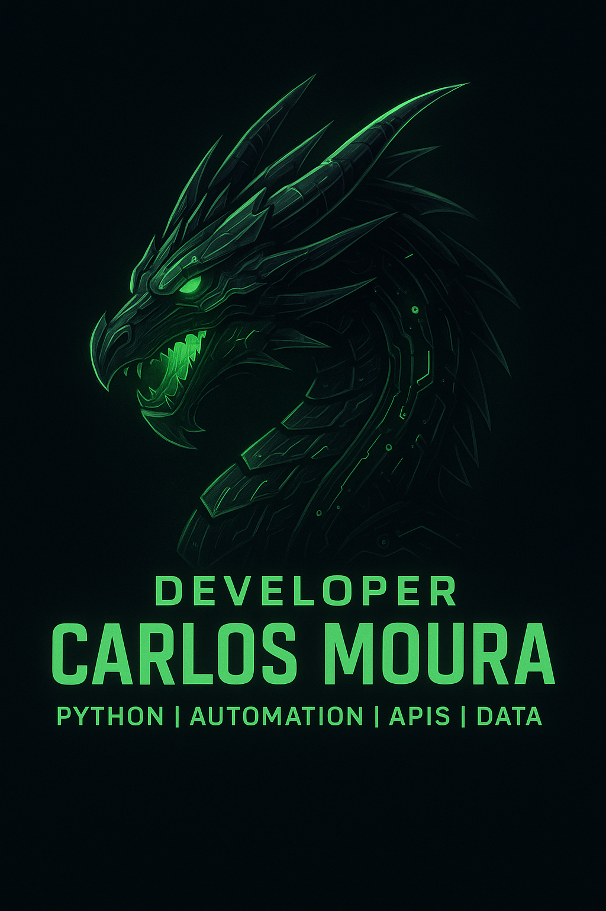

  

# 👋 Hey, I’m Carlos

💻 **Python Developer** | 🌍 Automation & Data for Global Market | 🚀 Backend & APIs Enthusiast  

---

## 🚀 About Me
- 🎯 Focused on **Python, Automation, APIs, and Backend Development**
- 🌍 Building projects for an **international portfolio**
- 📚 Currently studying **advanced Python, data engineering and system integration**
- ⚡ Geek/otaku culture + tech innovation

---

## 🏆 Achievements & Skills
**Core stack:** Python • REST APIs • SQL • Git/GitHub • Docker • Linux • CI/CD  
**Also:** FastAPI/Flask • PostgreSQL • Requests/AIOHTTP • Pandas

  
  
  
  
  
  
  

---

## 📊 GitHub Stats

---

## 🔗 Connect with Me

---
✨ *“Code, Create, and Evolve — one commit at a time.”*
